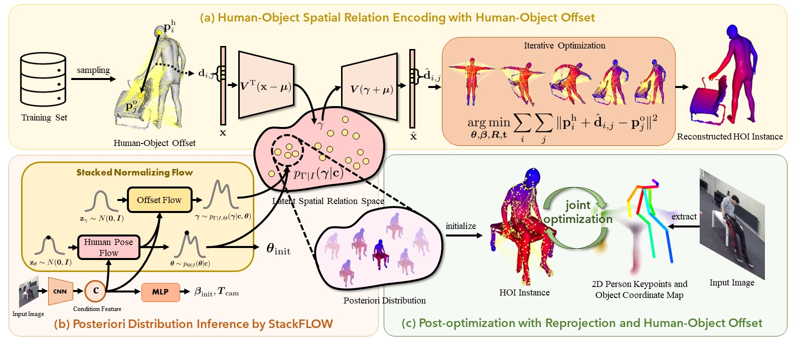

# StackFLOW

This repository contains the official implementation for our paper: StackFLOW: Monocular Human-Object Reconstruction by Stacked Normalizing Flow with Offset.

[]() []() []()

#### Main Pipeline



**Main framework for our method.** (a) We use human-object offset to encode the spatial relation between the human and the object. For a human-object pair, offsets are calculated and flattened into an offset vector x. Based on all offset vectors calculated from the training set, the latent spatial relation space is constructed using principal component analysis. To get a vectorized representation for human-object spatial relation, the offset vector is projected into this latent spatial relation space by linear projection. Inversely, given a sample γ from this latent spatial relation space, we can reproject it to recover offset vector xˆ. The human-object instance can be reconstructed from xˆ by iterative optimization. (b) With pre-constructed latent spatial relation space, we use stacked normalizing flow to infer the posterior distribution of human-object spatial relation for an input image. (c) In the post-optimization stage, we further finetune the reconstruction results using 2D-3D reprojection loss and offset loss.

## Pre-trained Models and Performance Comparison

### On BEHAVE Dataset

<table>
    <caption><b>Performance Comparison on BEHAVE Dataset</b></caption>
    <thead>
        <tr>
            <th rowspan="2", align="center">Model</td>
            <th rowspan="2", align="center">Visible Ratio</td>
            <th rowspan="2", align="center">Post-Optimization</td>
            <th colspan="2", align="center">HOI aligned</td>
            <th colspan="2", align="center">w/o HOI aligned</td>
        </tr>
        <tr>
            <th align="center">SMPL</td>
            <th align="center">Object</td>
            <th align="center">SMPL</td>
            <th align="center">Object</td>
        </tr>
	</thead>
	<tbody>
        <tr>
            <td align="center"><a href="https://arxiv.org/abs/2007.15649">PHOSA</a></td>
            <td align="center">>0.3</td>
            <td align="center">√</td>
            <td align="center">12.17±11.13</td>
            <td align="center">26.62±21.87</td>
            <td align="center">-</td>
            <td align="center">-</td>
        </tr>
        <tr>
            <td align="center"><a href="https://github.com/xiexh20/CHORE">CHORE</a></td>
            <td align="center">>0.3</td>
            <td align="center">√</td>
            <td align="center">5.58±2.11</td>
            <td align="center">10.66±7.71</td>
            <td align="center">-</td>
            <td align="center">-</td>
        </tr>
        <tr>
            <td rowspan="4", align="center"><a href="https://shanghaitecheducn-my.sharepoint.com/:f:/g/personal/huochf_shanghaitech_edu_cn/EvZicj-gCZtKp0DRl6CAYw8BnDyXLQk667uszsLTda8DWA?e=3IDHOe">StackFLOW</a></td>
            <td rowspan="2", align="center">all</td>
            <td align="center">×</td>
            <td align="center">4.72±1.99</td>
            <td align="center">11.85±11.02</td>
            <td align="center">7.63±5.88</td>
            <td align="center">15.71±14.35</td>
        </tr>
        <tr>
            <td align="center">√</td>
            <td align="center">4.50±1.91</td>
            <td align="center">9.12±8.82</td>
            <td align="center">9.41±14.88</td>
            <td align="center">11.15±18.12</td>
        </tr>
        <tr>
            <td rowspan="2", align="center">>0.3</td>
            <td align="center">×</td>
            <td align="center">4.71±1.99</td>
            <td align="center">11.45±10.43</td>
            <td align="center">7.66±5.98</td>
            <td align="center">15.19±13.57</td>
        </tr>
        <tr>
            <td align="center">√</td>
            <td align="center">4.51±1.92</td>
            <td align="center">8.77±8.33</td>
            <td align="center">9.26±15.03</td>
            <td align="center">10.51±17.76</td>
        </tr>
        <tr>
            <td rowspan="4", align="center"><a href="https://shanghaitecheducn-my.sharepoint.com/:f:/g/personal/huochf_shanghaitech_edu_cn/Et9Kvd5ThtZIkG_lCNh0-8sBj2CsI2t3dFuzMryHYR5Tgw?e=RWMcWe">StackFLOW-AUG</a></td>
            <td rowspan="2", align="center">all</td>
            <td align="center">×</td>
            <td align="center">4.62±1.93</td>
            <td align="center">12.16±11.73</td>
            <td align="center"><b>7.37±3.95</b></td>
            <td align="center">16.15±14.85</td>
        </tr>
        <tr>
            <td align="center">√</td>
            <td align="center">4.43±1.85</td>
            <td align="center">8.71±8.58</td>
            <td align="center">8.79±10.74</td>
            <td align="center">10.90±15.17</td>
        </tr>
        <tr>
            <td rowspan="2", align="center">>0.3</td>
            <td align="center">×</td>
            <td align="center">4.60±1.93</td>
            <td align="center">11.63±10.90</td>
            <td align="center">7.40±4.00</td>
            <td align="center">15.49±13.83</td>
        </tr>
        <tr>
            <td align="center">√</td>
            <td align="center"><b>4.43±1.86</b></td>
            <td align="center"><b>8.30±7.91</b></td>
            <td align="center">8.62±10.78</td>
            <td align="center"><b>10.19±14.44</b></td>
        </tr>
    </tbody>
</table> 


### On InterCap Dataset

<table>
    <caption><b>Performance Comparison on InterCap Dataset</b></caption>
    <thead>
        <tr>
            <th rowspan="2", align="center">Model</td>
            <th rowspan="2", align="center">Post-Optimization</td>
            <th colspan="2", align="center">Align w=1</td>
            <th colspan="2", align="center">Align w=10</td>
        </tr>
        <tr>
            <th align="center">SMPL</td>
            <th align="center">Object</td>
            <th align="center">SMPL</td>
            <th align="center">Object</td>
        </tr>
	</thead>
	<tbody>
        <tr>
            <td rowspan="4", align="center"><a href="https://shanghaitecheducn-my.sharepoint.com/:f:/g/personal/huochf_shanghaitech_edu_cn/ElpW_6hPjP5IhIN2yfaZJzsB_gMwcnuEzaVzcFA1r-wQoQ?e=5SVMyw">StackFLOW</a></td>
            <td align="center">×</td>
            <td align="center">4.89±2.27</td>
            <td align="center">11.38±9.40</td>
            <td align="center"><b>5.37±2.53</b></td>
            <td align="center"><b>12.11±10.33</b></td>
        </tr>
        <tr>
            <td align="center">√</td>
            <td align="center"><b>4.71±2.09</b></td>
            <td align="center"><b>9.44±8.75</b></td>
            <td align="center">-</td>
            <td align="center">-</td>
        </tr>
        <tr>
            <td align="center">√ ( + sequence smooth)</td>
            <td align="center">5.46±4.16</td>
            <td align="center">11.58±15.35</td>
            <td align="center">6.01±4.25</td>
            <td align="center">12.21±15.80</td>
        </tr>
    </tbody>
</table> 


### On BEHAVE-Extended Dataset

**Full-Sequence Evaluation**

<table>
    <caption><b>Performance Comparison on BEHAVE-extended Dataset</b></caption>
    <thead>
        <tr>
            <th rowspan="2", align="center">Model</td>
            <th rowspan="2", align="center">Post-Optimization</td>
            <th colspan="2", align="center">Align w=1</td>
            <th colspan="2", align="center">Align w=10</td>
        </tr>
        <tr>
            <th align="center">SMPL</td>
            <th align="center">Object</td>
            <th align="center">SMPL</td>
            <th align="center">Object</td>
        </tr>
	</thead>
	<tbody>
        <tr>
            <td align="center"><a href="https://github.com/xiexh20/CHORE">CHORE</a></td>
            <td align="center">√</td>
            <td align="center">5.55</td>
            <td align="center">10.02</td>
            <td align="center">18.33</td>
            <td align="center">20.32</td>
        </tr>
        <tr>
            <td align="center"><a href="https://github.com/xiexh20/VisTracker">VisTracker</a></td>
            <td align="center">√</td>
            <td align="center">5.25</td>
            <td align="center"><b>8.04</b></td>
            <td align="center">7.81</td>
            <td align="center"><b>8.49</b></td>
        </tr>
        <tr>
            <td rowspan="4", align="center"><a href="https://shanghaitecheducn-my.sharepoint.com/:f:/g/personal/huochf_shanghaitech_edu_cn/ElZkchKPON5CgylrtH-ziFMBn9fF_xs4GizatPGEEH9a6w?e=8NWLzw">StackFLOW</a></td>
            <td align="center">×</td>
            <td align="center">4.42±1.96</td>
            <td align="center">10.87±10.43</td>
            <td align="center">5.23±2.42</td>
            <td align="center">11.64±10.98</td>
        </tr>
        <tr>
            <td align="center">√ (w/o offset loss)</td>
            <td align="center">4.49±2.01</td>
            <td align="center">9.14±8.53</td>
            <td align="center">5.01±2.66</td>
            <td align="center">9.36±8.67</td>
        </tr>
        <tr>
            <td align="center">√ ( + sequence smooth)</td>
            <td align="center"><b>4.39±2.46</b></td>
            <td align="center">8.57±8.96</td>
            <td align="center"><b>4.98±3.07</b></td>
            <td align="center">8.94±9.29</td>
        </tr>
    </tbody>
</table> 


## Run Demo

Follow [these instructions](./docs/SET_UP_ENV.md) to set up the environments for this project. Make sure you have downloaded [the checkpoint](https://shanghaitecheducn-my.sharepoint.com/:f:/g/personal/huochf_shanghaitech_edu_cn/Et9Kvd5ThtZIkG_lCNh0-8sBj2CsI2t3dFuzMryHYR5Tgw?e=RWMcWe) and put it in the directory `PROJECT_ROOT/outputs/stackflow/behave_aug/`. Then run:

**Demo Occlusion:**

```
python ./demo_occlusion.py --cfg_file ./stackflow/configs/behave_aug.yaml --img_path ./data/demo/occlusion/3_3_basketball_none_026_0.color.jpg
```

Results will be written to the directory `PROJECT_ROOT/outputs/demo/occlusion/`.

**Demo Optimization with Multi-Object:**

```
python ./demo_multi_object.py --cfg_file ./stackflow/configs/behave_aug.yaml --post_optimization
```

Results will be written to the directory `PROJECT_ROOT/outputs/demo/multi_objects/`.

**Demo Optimization Full Sequence:**

Make sure you have downloaded [the checkpoint](https://shanghaitecheducn-my.sharepoint.com/:f:/g/personal/huochf_shanghaitech_edu_cn/ElZkchKPON5CgylrtH-ziFMBn9fF_xs4GizatPGEEH9a6w?e=8NWLzw) and have prepared the BEHAVE-Extended dataset following [this instruction](docs/DATA_PRE.md). 

```
python ./demo_sequence.py --cfg_file ./stackflow/configs/behave_extend.yaml --dataset_root_dir $BEHAVE_ROOT_DIR
```

We run this script on a single A100 GPU with 80GB memory. Results will be written to the directory `PROJECT_ROOT/outputs/demo/multi_objects/sequences`.

## Train StackFLOW

Before training, make sure you have prepared BEHAVE or InterCap dataset following [these instructions](./docs/DATA_PRE.md). 

* For the BEHAVE dataset, you should go through steps #1, #3, #4, and #6. If you want to train with augmented data, you should also go through steps #2 and #5.
* For the InterCap dataset and BEHAVE-Extended dataset, you should go through all steps.

Don't forget to redirect the path `_C.dataset.bg_dir` (in file `PROJECT_DIR/stackflow/configs/__init__.py` (line 25)) to `VOC_DIR` in your custom setting. Then run:

```
python ./stackflow/train.py --cfg_file ./stackflow/configs/behave.yaml --dataset_root_dir $BEHAVE_ROOT_DIR
```

Our model can be trained within 2 days on a single GPU. The logs and checkpoints will be saved to the path `PROJECT_DIR/outputs/stackflow`.

## Evaluate StackFLOW

**Evaluate on BEHAVE dataset:**

Download the full mask from [here](https://datasets.d2.mpi-inf.mpg.de/cvpr22behave/behave-test-object-fullmask.zip) for BEHAVE datasets and zip it to the path `BEHAVE_ROOT_DIR`. Make sure the path for the checkpoint in `PROJECT_DIR/stackflow/configs/behave.yaml` exists. If you want to evaluate models with pose-optimization, you need to follow [this instruction](./docs/DEPENDENCIES.md) to prepare the keypoints of the person and the 2D-3D corresponding maps of the object.

```
python ./stackflow/evaluate_frames.py --cfg_file ./stackflow/configs/behave.yaml --dataset_root_dir $BEHAVE_ROOT_DIR
```

**Evaluate on BEHAVE-extended dataset:**

```
python ./stackflow/evaluate_sequences.py --cfg_file ./stackflow/configs/behave_extend.yaml --dataset_root_dir $BEHAVE_ROOT_DIR
```

The reconstruction results and evaluation metrics will be saved to the directory `PROJECT_DIR/outputs/stackflow`.

## Acknowledgments

This work borrows some codes from [ProHMR](https://github.com/nkolot/ProHMR) and [CDPN](https://github.com/LZGMatrix/CDPN_ICCV2019_ZhigangLi). Thanks for these fantastic works. 

## Contact

If you have any questions, please feel free to put forward your issues and contact me.

## Citation

```

```

